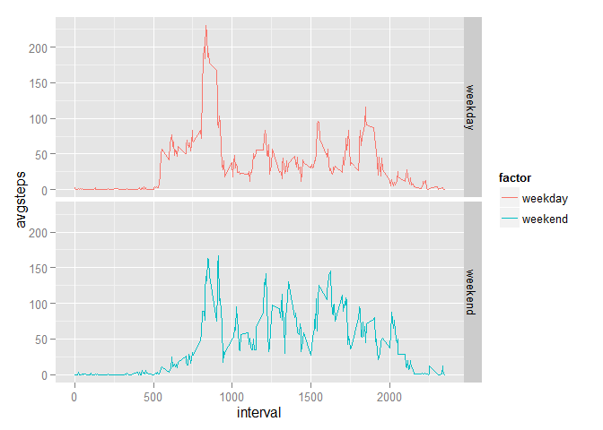

# Reproducible Research: Peer Assessment 1


## Loading and preprocessing the data
###Import Data


```r
rawdata<-read.csv("activity/activity.csv")

#New data set with NA's removed
filterNA<-complete.cases(rawdata)
rawdataNoNA<-rawdata[filterNA,]
```


## What is mean total number of steps taken per day?
###Histogram of total number of steps taken each day (NA's removed)
I use the **sqldf** package for aggregating data!

```r
library("sqldf")
```

```
## Loading required package: gsubfn
## Loading required package: proto
## Loading required package: RSQLite
## Loading required package: DBI
```

```r
aggdata<-sqldf("SELECT date, sum(steps) AS totalsteps 
                FROM rawdataNoNA 
                GROUP BY date
                ORDER BY date")
```

```
## Loading required package: tcltk
```

```r
hist(aggdata$totalsteps, main = "Histogram of Total Steps", xlab = "Total Steps Per Day")
```

 

###The mean and median of steps taken per day

```
## [1] "The mean is 10766.1886792453"
```

```
## [1] "The median is 10765"
```


## What is the average daily activity pattern?
###Time Series Plot of steps averaged across days
First I calcuated the averages, then made the graph below using ggplot2.

 

The interval that contains the max average steps is 835.


## Imputing missing values
The number of NA's is 


```
## [1] 2304
```

I will use the mean for the 5-minute intervals to replace the NA's. Below is the code. The dataset cleanupNA will all the NA's replaced with the mean value of the corresponding interval


```r
#Use Mean's to replace NA's
cleanupNA<-merge(rawdata,aggdata2, by="interval")

i<-1
loopend<-dim(cleanupNA)[1]

for (i in 1:loopend) {
    if (is.na(cleanupNA[i,2])==TRUE){
        cleanupNA[i,2]<-cleanupNA[i,4]
    }
}


cleanupNA<-sqldf("SELECT * FROM cleanupNA ORDER BY date, interval, steps")
```

Below is the new histogram

 

```
## [1] "The new mean is 10766.1886792453"
```

```
## [1] "The new median is 10766.1886792453"
```
After replacing the NA's with the mean of their respective interval, we see the median and the mean are equivalent now.

## Are there differences in activity patterns between weekdays and weekends?

###Weekdays vs. Weekends patterns
The factor variable has value **1** for **weekend** and **2** for **weekday**

```r
#add weekday factor
i <- 1
loopend<- dim(cleanupNA)[1]

#factor: 1 = weekend, 2 = weekday
for (i in 1:loopend){
    
    if (weekdays( as.Date(cleanupNA$date[i])) %in% c("Saturday","Sunday")){
        cleanupNA$factor[i] = "weekend"
    } else {
        cleanupNA$factor[i] = "weekday" 
    }
}

cleanupNA$factor <- as.factor(cleanupNA$factor)
```

Below is the graph of the average steps factored across weekdays or weekends

 

